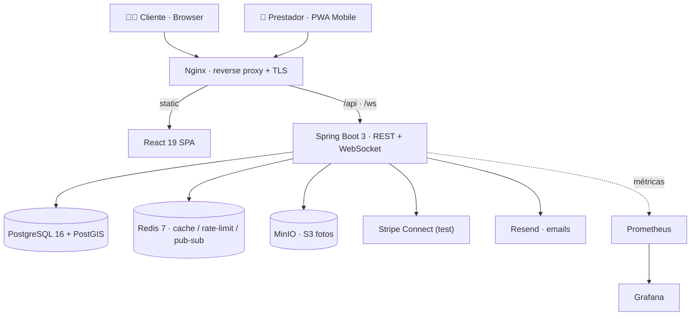
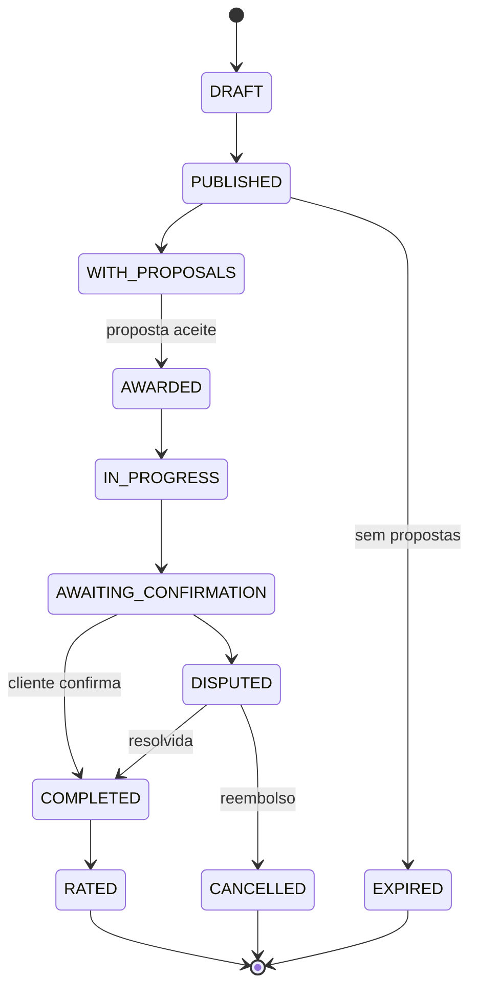

<p align="center">
  
</p>

<h1 align="center">AgroConnect</h1>

<p align="center">
  <strong>Marketplace geolocalizado de serviços agrários + backoffice operacional para prestadores</strong><br/>
  <em>Do pedido ao pagamento em escrow, da execução no terreno ao lucro real por máquina.</em>
</p>

<p align="center">
  <a href="https://agroconnect.pt"></a>
</p>

<p align="center">
  <a href="https://github.com/ratzPereira/AgroConnect/actions/workflows/ci.yml"></a>
  
  
  
  
</p>

<p align="center">
  
  
  
  
  
  
</p>

---

## Índice

- [Sobre](#sobre)
- [Demo ao vivo](#demo-ao-vivo)
- [Destaques de engenharia](#destaques-de-engenharia)
- [Capturas de ecrã](#capturas-de-ecrã)
- [Funcionalidades](#funcionalidades)
- [Stack tecnológica](#stack-tecnológica)
- [Arquitetura](#arquitetura)
- [Ciclo de vida do pedido](#ciclo-de-vida-do-pedido)
- [Qualidade e testes](#qualidade-e-testes)
- [Arranque rápido](#arranque-rápido)
- [Documentação da API](#documentação-da-api)
- [Estrutura do repositório](#estrutura-do-repositório)
- [CI/CD](#cicd)
- [Sobre o projeto](#sobre-o-projeto)

---

## Sobre

O **AgroConnect** liga agricultores a prestadores de serviços agrários — lavoura, pulverização, colheita, jardinagem, transporte — na Região Autónoma dos Açores, um setor com milhares de pequenas explorações e quase nenhuma digitalização.

O agricultor publica um **pedido geolocalizado**, os prestadores da zona respondem com **propostas**, o agricultor escolhe, o **pagamento fica retido em escrow** até o trabalho ser confirmado, a execução é **documentada no terreno** (check-in GPS + fotos) e ambas as partes **avaliam-se**. Do lado do prestador, um **backoffice completo** gere equipas, maquinaria, inventário e finanças — com **lucro real por máquina e por operador**.

Não é um CRUD. É um sistema distribuído com pagamentos, geolocalização, tempo real e contabilidade operacional, construído com a disciplina de um produto a sério.

---

## Demo ao vivo

> **[https://agroconnect.pt](https://agroconnect.pt)** &nbsp;·&nbsp; ambiente de demonstração (VPS, HTTPS) &nbsp;·&nbsp; pagamentos em **modo de teste Stripe**

Credenciais de demonstração (palavra-passe: `password123`):

| Perfil | Email |
| --- | --- |
| 👨‍🌾 Cliente (agricultor) | `joao.silva@email.com` |
| 🚜 Prestador de serviços | `agroservicos@email.com` |

> Cartão de teste Stripe: `4242 4242 4242 4242` · qualquer data futura · qualquer CVC.

---

## Destaques de engenharia

O que distingue este projeto de um marketplace genérico:

- **🛰️ Geo-matching nativo na base de dados** — pesquisa de proximidade com `ST_DWithin` do **PostGIS** sobre colunas `geography` e índices espaciais **GIST**, em vez de chamadas a APIs externas. Mais rápido, mais barato, mais fiável.
- **💳 Escrow robusto com Stripe Connect** — padrão *separate charges & transfers*, com **idempotência *exactly-once*** nos webhooks (tabela de eventos processados, *claim-then-process*) e **locking pessimista** na aceitação de propostas para resolver corridas concorrentes (HTTP 200 vs 409).
- **📦 Inventário *event-sourced*** — o stock é a projeção de um **livro de movimentos imutável**; o **custo médio ponderado (WAC)** é recalculado transacionalmente a cada entrada, com soft-delete e locking pessimista contra compras simultâneas.
- **🧾 *Job costing* com *snapshots*** — cada execução regista materiais + mão-de-obra, capturando o **preço unitário e a tarifa horária do momento**, para que relatórios históricos sejam imunes a alterações futuras de catálogo.
- **📊 Contabilidade operacional real** — P&L por máquina e por operador, dashboard financeiro com decomposição de lucro líquido e comparação ano-a-ano.
- **⚡ Tempo real** — WebSocket STOMP para propostas, notificações e chat contextual.
- **🏭 Qualidade industrial** — **90,4 %** de cobertura de linhas (JaCoCo), testes de integração com **Testcontainers** (PostgreSQL+PostGIS e Redis reais), **E2E com Playwright**, carga com **k6**, e **CI/CD com rollback automático**.

---

## Capturas de ecrã

<p align="center">
  
</p>
<p align="center"><em>Dashboard do cliente como PWA num telemóvel.</em></p>

<table>
  <tr>
    <td width="50%"><p align="center"><em>Pipeline CI/CD (GitHub Actions) — verde de ponta a ponta</em></p></td>
    <td width="50%"><p align="center"><em>SonarCloud — Quality Gate aprovado, 0 vulnerabilidades</em></p></td>
  </tr>
  <tr>
    <td width="50%"><p align="center"><em>API documentada — 134 endpoints (Swagger UI)</em></p></td>
    <td width="50%"><p align="center"><em>1644 testes de frontend a passar (Vitest)</em></p></td>
  </tr>
</table>

---

## Funcionalidades

<details open>
<summary><strong>Marketplace de serviços</strong></summary>

- Pedidos geolocalizados com **formulários dinâmicos por categoria** (schema JSONB + componente React genérico)
- Propostas com comparação de preço, *rating* e histórico do prestador
- **Escrow** (Stripe Connect test + wallet interna): captura imediata, libertação só após confirmação do cliente
- Janela de **auto-confirmação** para evitar pedidos eternamente pendentes
- **Avaliação bidirecional** (cliente ↔ prestador) com janela temporal
</details>

<details>
<summary><strong>Backoffice do prestador — "OS de operações"</strong></summary>

- **Inventário event-sourced** com WAC, ledger imutável e locking pessimista
- **Job costing** por execução (materiais + mão-de-obra, com snapshot de preços)
- **P&L por máquina**: receita, manutenções, despesas, utilização, rentabilidade
- **P&L por operador**: trabalhos, receita gerada, lucro, tarifa horária editável
- **Dashboard financeiro** com lucro líquido, margem e comparação ano-a-ano
- **Calendário de operações** em Gantt com deteção de conflitos, equipas (gestor/chefe/operador) e maquinaria
</details>

<details>
<summary><strong>Execução no terreno</strong></summary>

- Check-in do operador com **validação GPS**
- Upload de **fotos geolocalizadas** como prova de execução
- Registo de materiais consumidos (drena stock e captura custo)
</details>

<details>
<summary><strong>Administração &amp; plataforma</strong></summary>

- Dashboard de métricas globais, resolução de disputas, moderação e gestão de utilizadores (ban/unban)
- Marketplace de **produtos** agrícolas com chat contextual
- Notificações e **emails transacionais** orientados a eventos
- Conformidade **RGPD**: exportação e eliminação de conta com anonimização
</details>

---

## Stack tecnológica

| Camada | Tecnologia |
| --- | --- |
| **Backend** | Spring Boot 3 · Java 17 · Spring Security · JWT (access 15 min + refresh 7 d) |
| **Frontend** | React 19 · TypeScript (strict) · Tailwind v4 · Vite 8 · React Query · React Hook Form + Zod · Recharts |
| **Base de dados** | PostgreSQL 16 · PostGIS · Flyway (35 migrações + 7 seed) |
| **Cache / tempo real** | Redis 7 · Spring WebSocket (STOMP/SockJS) |
| **Pagamentos** | Stripe Connect (test mode) · wallet interna |
| **Ficheiros** | MinIO (S3-compatible, presigned URLs) |
| **Mapas** | Leaflet · OpenStreetMap · CartoDB |
| **Infra** | Docker Compose · Nginx (TLS 1.2/1.3, HSTS, OCSP) · GitHub Actions |
| **Observabilidade** | Prometheus · Grafana · Spring Actuator |
| **Qualidade** | SonarCloud · JUnit 5 · Mockito · Testcontainers · Playwright · k6 |
| **API Docs** | springdoc-openapi (Swagger UI) — 134 endpoints |

---

## Arquitetura



9 serviços containerizados em produção, geridos por Docker Compose, atrás de um único Nginx com TLS.

---

## Ciclo de vida do pedido

Máquina de estados formal — cada transição é validada no serviço (caso contrário, `InvalidStateException`):



---

## Qualidade e testes

| Métrica | Valor |
| --- | --- |
| Testes unitários (backend) | **869** |
| Testes de integração (backend, Testcontainers) | **199** |
| Testes de frontend (Vitest + RTL + MSW) | **1644** em 225 ficheiros |
| Testes E2E (Playwright) | **9** |
| Cobertura de linhas (JaCoCo, backend) | **90,4 %** |
| SonarCloud | **Quality Gate aprovado** · 0 vulnerabilidades · ratings A |
| Desempenho (k6) | p95 de leitura **5–23 ms**, 0 erros |

```bash
# Backend — unit + integração (precisa de Docker para Testcontainers)
cd backend && mvn verify

# Frontend — unit + cobertura
cd frontend && npm run test -- --coverage

# E2E (Playwright)
cd frontend && npm run e2e
```

---

## Arranque rápido

**Pré-requisitos:** Docker e Docker Compose.

```bash
git clone https://github.com/ratzPereira/AgroConnect.git
cd AgroConnect
cp .env.example .env
docker compose -f docker-compose.dev.yml up
```

| Serviço | URL |
| --- | --- |
| Aplicação (via Nginx) | http://localhost:8000 |
| Frontend (Vite dev) | http://localhost:13000 |
| Swagger UI | http://localhost:18080/api/swagger-ui/index.html |
| Health check | http://localhost:18080/api/actuator/health |
| MinIO Console | http://localhost:19001 |
| Grafana | http://localhost:13001 |
| Prometheus | http://localhost:19090 |
| Mailpit (emails dev) | http://localhost:18025 |

Os dados de demonstração (explorações reais dos Açores) são carregados automaticamente por Flyway.

---

## Documentação da API

A API REST está totalmente documentada com **springdoc-openapi**. Em produção, a especificação OpenAPI está acessível em **[agroconnect.pt/v3/api-docs](https://agroconnect.pt/v3/api-docs)** (134 endpoints). Em desenvolvimento, o Swagger UI corre em `http://localhost:18080/api/swagger-ui/index.html`.

---

## Estrutura do repositório

```
agroconnect/
├── backend/               # Spring Boot 3 (Maven) — REST + WebSocket
│   ├── src/main/java/     # config · security · controller · service · repository · model · dto · mapper · event
│   └── src/test/java/     # unit (Mockito) + integration (Testcontainers)
├── frontend/              # React 19 + TypeScript (Vite) — feature-based
│   ├── src/               # api · components · features · hooks · pages · stores
│   └── e2e/               # Playwright
├── docker/                # Dockerfiles + Nginx, Prometheus, Grafana
├── .github/workflows/     # CI/CD (ci.yml, e2e.yml)
├── docs/                  # documentação, diagramas, dev-journal
├── docker-compose.yml     # produção (9 serviços)
├── docker-compose.dev.yml # desenvolvimento (hot-reload, portas de debug)
└── CLAUDE.md              # regras de engenharia do projeto
```

---

## CI/CD

Pipeline GitHub Actions (`ci.yml`) em cada *push* para `main`:

1. **Backend** — `mvn verify` (unit + integração com PostGIS/Redis reais) + cobertura JaCoCo
2. **Frontend** — ESLint + `tsc` + build + Vitest com cobertura
3. **SonarCloud** — análise estática + cobertura consolidada
4. **Docker** — build das imagens + scan de vulnerabilidades (Trivy)
5. **Deploy** — para o VPS via SSH com **backup pg_dump → build → health-check → rollback automático** em caso de falha

---

## Sobre o projeto

> **Projeto Final de Curso** — Licenciatura em Engenharia Informática, **Universidade Aberta** (2025/2026)
> Autor: **João Pereira** · Orientador: **Professor Ricardo Baptista**

Desenvolvido com a meta de refletir maturidade de engenharia de ponta a ponta — da modelação de domínio e testes à infraestrutura e observabilidade.

## Licença

Desenvolvido no âmbito do Projeto Final de Curso da Licenciatura em Engenharia Informática da Universidade Aberta. Todos os direitos reservados © 2026 João Pereira.
